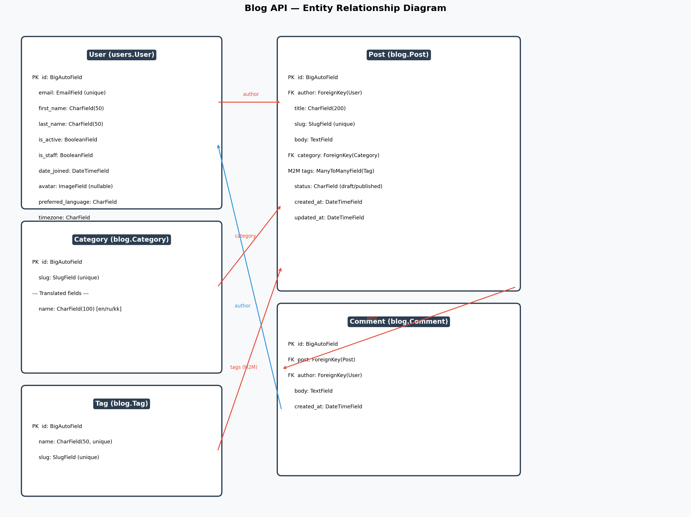

# Blog API

A full-featured blog REST API built with Django REST Framework, JWT authentication, Redis caching, multilanguage support, and async external data fetching.

## ERD



## Features

- Custom User model (email-based login)
- JWT authentication (register, login, token refresh)
- Blog CRUD (posts, comments, categories, tags)
- Multilanguage support: English, Russian, Kazakh
- Redis caching with language-aware cache keys
- Rate limiting on auth and post creation endpoints
- Redis Pub/Sub for comment events
- Async external data fetching (exchange rates + Almaty time)
- OpenAPI docs: Swagger UI and ReDoc
- Full logging with rotating file handler

## Quick Start

```bash
bash scripts/start.sh
```

After startup:
- API: http://127.0.0.1:8000/api/
- Swagger: http://127.0.0.1:8000/api/docs/
- ReDoc: http://127.0.0.1:8000/api/redoc/
- Admin: http://127.0.0.1:8000/admin/

## API Endpoints

### Auth
| Method | URL | Auth | Description |
|--------|-----|------|-------------|
| POST | /api/auth/register/ | No | Register new user |
| POST | /api/auth/token/ | No | Get JWT tokens |
| POST | /api/auth/token/refresh/ | No | Refresh access token |
| PATCH | /api/auth/language/ | Yes | Set preferred language |
| PATCH | /api/auth/timezone/ | Yes | Set timezone |

### Posts
| Method | URL | Auth | Description |
|--------|-----|------|-------------|
| GET | /api/posts/ | No | List published posts (cached) |
| POST | /api/posts/ | Yes | Create post |
| GET | /api/posts/{slug}/ | No | Get post |
| PATCH | /api/posts/{slug}/ | Yes (owner) | Update post |
| DELETE | /api/posts/{slug}/ | Yes (owner) | Delete post |
| GET | /api/posts/{slug}/comments/ | No | List comments |
| POST | /api/posts/{slug}/comment/ | Yes | Add comment |

### Stats
| Method | URL | Auth | Description |
|--------|-----|------|-------------|
| GET | /api/stats/ | No | Blog stats + exchange rates + Almaty time |

## Project Structure

```
manage.py
requirements/
  base.txt
  dev.txt
  prod.txt
apps/
  users/         # Custom user model, JWT auth
  blog/          # Posts, comments, categories, tags
  core/          # Language middleware, exception handler
settings/
  conf.py        # Reads .env via python-decouple
  base.py        # Shared settings
  env/
    local.py     # DEBUG=True, SQLite
    prod.py      # DEBUG=False, PostgreSQL
  urls.py
  wsgi.py
  asgi.py
locale/          # Translation files (en, ru, kk)
docs/            # ERD image
scripts/         # start.sh
templates/       # Email templates
logs/            # Log files (gitignored)
```

## Environment Variables

Copy `settings/.env.example` to `settings/.env` and fill in the values:

```
BLOG_ENV_ID=local
BLOG_SECRET_KEY=your-secret-key
BLOG_DEBUG=True
BLOG_ALLOWED_HOSTS=localhost,127.0.0.1
BLOG_REDIS_URL=redis://localhost:6379/0
BLOG_EMAIL_BACKEND=django.core.mail.backends.console.EmailBackend
BLOG_DEFAULT_FROM_EMAIL=noreply@blogapi.com
```

## Redis Pub/Sub

Listen for new comment events:

```bash
python manage.py listen_comments
```

## Management Commands

```bash
python manage.py seed_data        # Seed test data
python manage.py listen_comments  # Subscribe to comment events
```
